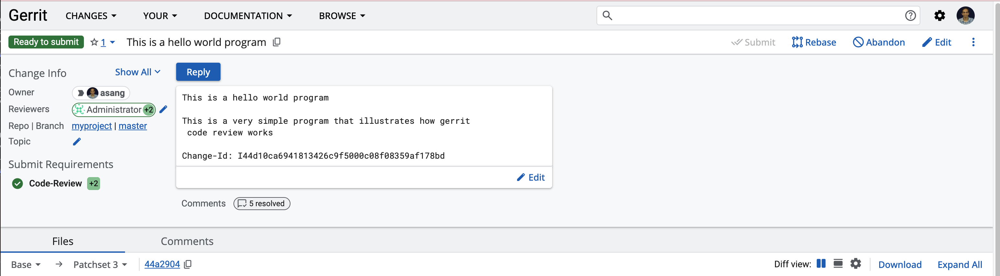
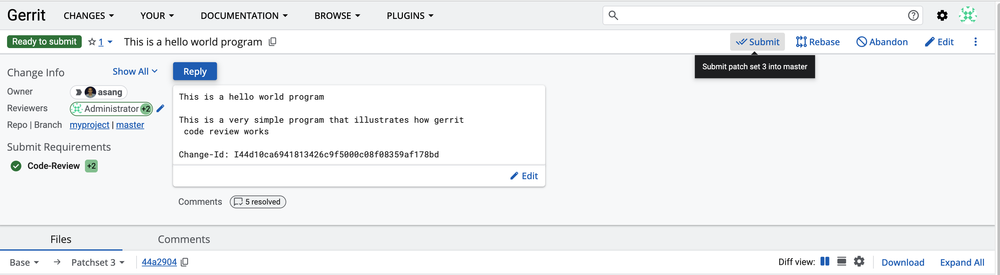

<!-- START doctoc generated TOC please keep comment here to allow auto update -->
<!-- DON'T EDIT THIS SECTION, INSTEAD RE-RUN doctoc TO UPDATE -->
# Getting ready to use the git & gerrit workflow

- [Getting ready to use the git & gerrit workflow](#getting-ready-to-use-the-git--gerrit-workflow)
  - [Working collaboratively in a controlled environment](#working-collaboratively-in-a-controlled-environment)
  - [Generate SSH key for yourself](#generate-ssh-key-for-yourself)
  - [Add the generated SSH key to your account for gerrit](#add-the-generated-ssh-key-to-your-account-for-gerrit)
  - [Cloning a repository](#cloning-a-repository)
  - [Making the changes and commiting the code](#making-the-changes-and-commiting-the-code)
  - [Push the changes](#push-the-changes)
  - [Code Review](#code-review)
    - [Responding to comments](#responding-to-comments)
  - [References](#references)

<!-- END doctoc generated TOC please keep comment here to allow auto update -->

## Working collaboratively in a controlled environment

Just because you understand `git` and have a repository, doesn't mean that you can work effectively in a corporate development environment. You need many more tools. Some of these are:

- Code Review
- Issue (Bug) tracking
- Project management
- Release management

There are many commercial and open source options for this. I have chosen to use [Gerrit Code Review](https://www.gerritcodereview.com/). It has integrated `git` repository management support and is widely used. Google created and subsequently, Open Sourced it. It also supports wide variety of plugins. We use it extensively in the company that I work for. Lets see how to put it to use.

If you are using your own `Gerrit Server`, follow [these instructions](gerrit-setup/gerrit_instructions.md).

You should connect to Gerrit from inside your `code-server` [container](Setup.md#installing-code-server-docker-container) as all the programming tools are installed there. First step is to order to generate a SSH keypair. SSH key is required to clone the git repositories hosted by Gerrit Code Review via `ssh` command. To enter the code-server container shell, execute following command:
 
```sh
$ docker exec -it code-server /bin/bash
coder@3929e2690e0e:~
```

## Generate SSH key for yourself

Once you are inside the code-server container, run the following command to generate a SSH public-private keypair, run the following command:
 
```sh
coder@3929e2690e0e:~$ ssh-keygen -f ~/.ssh/id_ed25519 -t ed25519 -N ""
Generating public/private ed25519 key pair.
Created directory '/home/coder/.ssh'.
Your identification has been saved in /home/coder/.ssh/id_ed25519
Your public key has been saved in /home/coder/.ssh/id_ed25519.pub
The key fingerprint is:
SHA256:fy3o9/46G0gBJb8CxC6T7aCm2cSKF36Xsafbg2wTNYc asangdani@8d51b53d46e7
The key's randomart image is:
+--[ED25519 256]--+
|       .. o..    |
|       ..  +     |
|       +..  o    |
|      = E..  o   |
|   . . *So. o    |
|  . = o .. + o   |
| o O . *  o + o  |
|. * o O.o. ..... |
| . . oo=.... o==.|
+----[SHA256]-----+
```

In your `~/.ssh` directory, following two files will be created

```
coder@3929e2690e0e:~$ ls -la ~/.ssh
total 16
drwx------ 2 coder coder 4096 Oct 25 10:27 .
drwx------ 1 coder coder 4096 Oct 25 10:27 ..
-rw------- 1 coder coder  411 Oct 25 10:27 id_ed25519
-rw-r--r-- 1 coder coder  100 Oct 25 10:27 id_ed25519.pub
```

You need to copy the public key to your Gerrit Account. So first display its contents

```sh
coder@3929e2690e0e:~$ cat ~/.ssh/id_ed25519.pub
ssh-ed25519 AAAAC3NzaC1lZDI1NTE5AAAAIC17YXcm9X3FSkvepinKFWrYbOsTzD2WMUYWPrZqj7kA asangdani@8d51b53d46e7
```

Please note that you need to copy what appears on *your* terminal and not the key that appears in this document. The one appearing here is just for illustration purposes.

## Add the generated SSH key to your account for gerrit

Open following url in web browser, [http://server-ip:8080/login](http://server-ip:8080/login) as *yourself*. Go to Settings and under `New SSH key` text box, paste the line printed above (public key).  Now click "Add New SSH Key" button to save it. You are now ready to use gerrit via ssh. Just make sure that you have configured your `user.name` and `user.email` settings for `git`. Remember that your email addresss in the account on `gerrit` server must match the one specified in your git configuration. For more details, see [Gerrit Walkthroughts](https://gerrit-review.googlesource.com/Documentation/intro-gerrit-walkthrough.html).

## Cloning a repository

Once the administrator has created a project for you, you can [clone it](http://server-ip:8080/admin/repos/myproject,general) it. Make sure you copy the entire `SSH` command next to `Clone with commit-hook` as shown in the image below:


```sh
coder@3929e2690e0e:~$ git clone "ssh://asang@server-ip:29418/myproject" && (cd "myproject" && mkdir -p `git rev-parse --git-dir`/hooks/ && curl -Lo `git rev-parse --git-dir`/hooks/commit-msg http://server-ip:8080/tools/hooks/commit-msg && chmod +x `git rev-parse --git-dir`/hooks/commit-msg)

Cloning into 'myproject'...
The authenticity of host '[192.168.88.5]:29418 ([192.168.88.5]:29418)' can't be established.
ED25519 key fingerprint is SHA256:cNiDbUAY8LnKlTYzGcv5VXIKZ8uuXy01xWLBtAQN7C8.
This key is not known by any other names.
Are you sure you want to continue connecting (yes/no/[fingerprint])? yes
Warning: Permanently added '[192.168.88.5]:29418' (ED25519) to the list of known hosts.
remote: Counting objects: 8, done
remote: Finding sources: 100% (8/8)
remote: Total 8 (delta 0), reused 6 (delta 0)
Receiving objects: 100% (8/8), 840 bytes | 840.00 KiB/s, done.
  % Total    % Received % Xferd  Average Speed   Time    Time     Time  Current
                                 Dload  Upload   Total   Spent    Left  Speed
100  3127  100  3127    0     0   502k      0 --:--:-- --:--:-- --:--:--  508k
coder@3929e2690e0e:~$ ls
myproject
coder@3929e2690e0e:~/myproject$ cd myproject
coder@3929e2690e0e:~/myproject$ git log --oneline
coder@3929e2690e0e:~/myproject$ git status
On branch master

No commits yet

nothing to commit (create/copy files and use "git add" to track)
```

## Making the changes and commiting the code

Now is the time to add your first code review using gerrit. For that we must add some files to the repository. Create a hello.cpp as follows:

```cpp
#include <iostream>

int
main()
{
   std::cout << "Hello world\n";
}
```

Add it to git repo

```sh
coder@3929e2690e0e:~/myproject$ nano hello.cpp
coder@3929e2690e0e:~/myproject$ git status
On branch master

No commits yet

Untracked files:
  (use "git add <file>..." to include in what will be committed)
	hello.cpp

nothing added to commit but untracked files present (use "git add" to track)

coder@3929e2690e0e:~/myproject$ git add hello.cpp
coder@3929e2690e0e:~/myproject$ git status
On branch master

No commits yet

Changes to be committed:
  (use "git rm --cached <file>..." to unstage)
	new file:   hello.cpp
```

Now commit the changes. You can use `nano` editor for your commit message. Make sure that first line is short (less than 80 characters) and title of the changes.

```sh
coder@3929e2690e0e:~/myproject$ git commit
[master (root-commit) e890de6] This is a hello world program
 1 file changed, 7 insertions(+)
 create mode 100644 hello.cpp
coder@3929e2690e0e:~/myproject$ git status
On branch master
Your branch is based on 'origin/master', but the upstream is gone.
  (use "git branch --unset-upstream" to fixup)

nothing to commit, working tree clean
coder@3929e2690e0e:~/myproject$ git log
commit a7ac13f45e68fbfb484b01da4b95f1972ca0660e (HEAD -> master)
Author: Asang Dani <asang.dani@gmail.com>
Date:   Sat Oct 25 11:13:57 2025 +0000

    This is a hello world program

    This is a very simple program that illustrates how gerrit code review works

    Change-Id:     Change-Id: I44d10ca6941813426c9f5000c08f08359af178bd
```

## Push the changes

Now you are ready to publish the changes to your teammates.

```sh
coder@3929e2690e0e:~/myproject$ git push origin HEAD:refs/for/master
Enumerating objects: 3, done.
Counting objects: 100% (3/3), done.
Delta compression using up to 8 threads
Compressing objects: 100% (2/2), done.
Writing objects: 100% (3/3), 376 bytes | 376.00 KiB/s, done.
Total 3 (delta 0), reused 0 (delta 0), pack-reused 0
remote: Processing changes: refs: 1, new: 1, done
remote: commit a7ac13f: warning: too many message lines longer than 72 characters; manually wrap lines
remote:
remote: SUCCESS
remote:
remote:   http://192.168.88.5:8080/c/myproject/+/1 This is a hello world program [NEW]
remote:
To ssh://192.168.88.5:29418/myproject
 * [new reference]   HEAD -> refs/for/master
```

## Code Review

The review page appears as follows:


Then reviewer adds comments and replies:


### Responding to comments

[](https://asciinema.org/a/kQhEnunkZpaetPg3RrLnBVoGy)

Remaining steps must be done in the browser by [marking the comments as Done](images/gerrit-review-reply.png) and hitting [Reply](images/gerrit-review-reply-2.png).

Reviewer sees that all comments are resolved and [replies with +2](images/gerrit-reviewer-ok-to-submit.png).

Submitter refreshes his view and sees



that the status has changed from `Active` to `Ready to submit` and `Submit requirements` are green.

Administrator decides that he is statisfied and clicks `Submit` button to merge the changes



to the `master` branch. After this status of the review changes to `Merged`. Now everyone can *see* the changes when the pull the latest version from the server.

## References

- [Gerrit workflow](https://gerrit-review.googlesource.com/Documentation/intro-gerrit-walkthrough.html)
