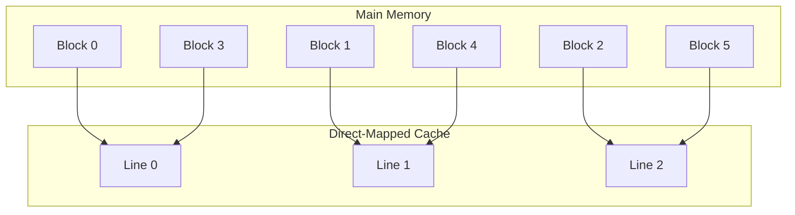
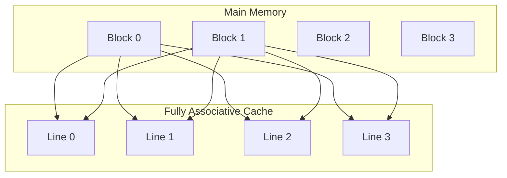
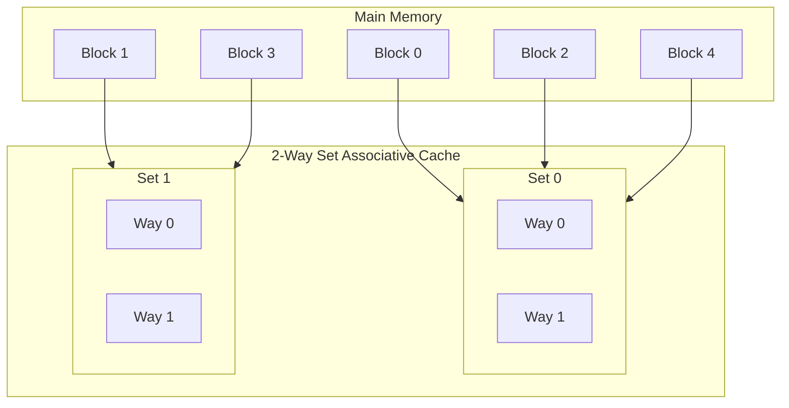
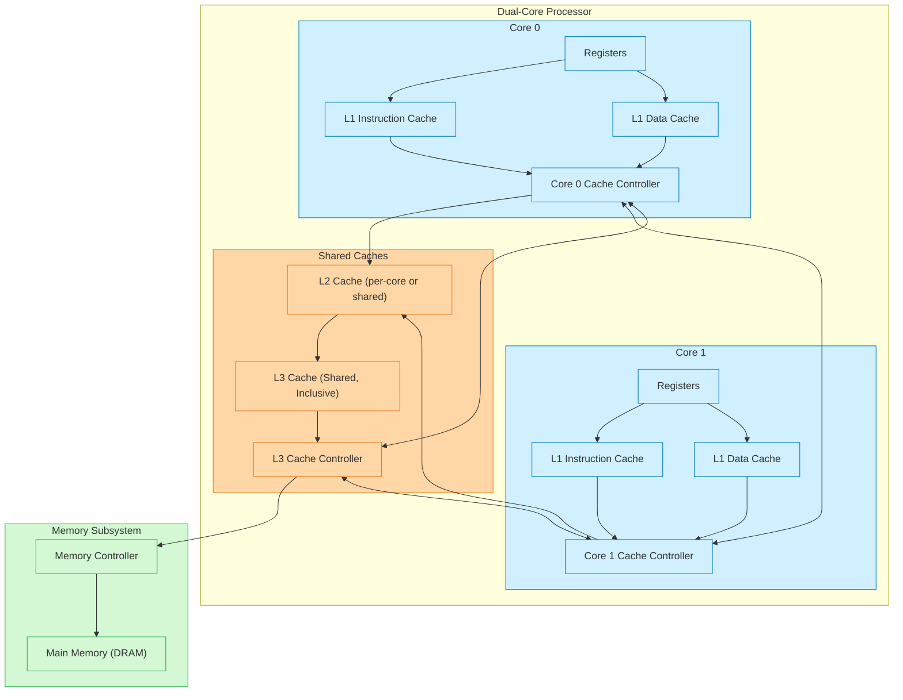

<!-- START doctoc generated TOC please keep comment here to allow auto update -->
<!-- DON'T EDIT THIS SECTION, INSTEAD RE-RUN doctoc TO UPDATE -->
**Table of Contents**  *generated with [DocToc](https://github.com/thlorenz/doctoc)*

- [What Every Programmer Should Know..](#what-every-programmer-should-know)
  - [CPU and Memory](#cpu-and-memory)
  - [L1 Cache](#l1-cache)
  - [Cost of Memory Access](#cost-of-memory-access)
  - [Appendix: Aliasing and Types of Caches](#appendix-aliasing-and-types-of-caches)
    - [Direct Mapped](#direct-mapped)
    - [Fully Associative](#fully-associative)
    - [Set Associative](#set-associative)
  - [References](#references)

<!-- END doctoc generated TOC please keep comment here to allow auto update -->

# What Every Programmer Should Know..

Almost all modern systems use Memory Hierarchies. Understanding how interaction between CPU and memory hierarchy works and programming with `cache friendliness` in mind has a profound impact on performance of your application and how you choose, design, and tune your data structures.

Most basic Operating System courses teach how Virtual Memory is employed by Operating Systems. So we will skip that description here. It suffices to know that the memory layout/map of a process is different on different operating systems and also depends on the type of CPU. For 64-bit linux, [x86_64](https://www.kernel.org/doc/Documentation/x86/x86_64/mm.txt) and [arm64](https://www.kernel.org/doc/Documentation/arm64/memory.txt) platforms, it can be quite different. Here we will focus primarily on how modern CPUs work with caches and how that affects the system performance.

## CPU and Memory

Caching works on the principle of:

1. **Temporal locality** - If we accessed some memory recently, then its likely that I will need to access it again in near future
2. **Spatial locality** - If we accessed some area in memory, its quite likely that *adjacencent* memory locations would be needed again - think about fields in a `struct/class` in C/C++ or elements in an array.

Another important thing to remember about memory hierarchy is *lower the level, faster the access and closeness to the CPU*. Lower level caches are smaller and more expensive. e.g. L1 caches are more expensive than L2 caches. For most modern processors, each cache line is 64 bytes. Which means that if you design your data structures such that they align well with cache line width, it will positively impact the performance of your application. Typical hierachical memory view with cache sizes and model is shown below. 

## L1 Cache

- Separate Instruction and Data Cache
- Typical size of single line - 64 bytes
- Number of cache lines = 32 kB / 64 = 512
- 8 way means 512 / 8 = 64 sets.
- Lowest 8 bit of the address correspond to an offset within a cache line and next 8 bits *implicitly* correspond to the set. Upper 16 bits (in case of 32-bit addrss) correspond to Tag bits - which are stored for each cache entry.
- Multiple addresses *alias* to the same set within cache. with 8 way-associative caches when comparing Tag bits within an address, comparison with Tags for all 8 cache lines within a set are compared parallely for efficiency.

## Cost of Memory Access

| Memory Level       | Access Time (cycles) | Typical Size  | Notes                                                  |
| ------------------ | -------------------- | ------------- | ------------------------------------------------------ |
| L1 Cache           | 3 – 5                | 32–128 KB     | Fastest, private to core, VIPT (Virtually Indexed, Physically Tagged) indexing                |
| L2 Cache           | 10 – 20              | 256 KB – 1 MB | Private to core or cluster, slower than L1             |
| L3 Cache           | 30 – 50              | 2–64 MB       | Shared between cores, physically indexed               |
| Main Memory (DRAM) | 50 – 150             | GBs           | Orders of magnitude slower, physical address access    |
| SSD/NVMe Storage   | 100K – 1M            | TBs           | Persistent storage, accessed via OS/hardware interface |
| HDD                | 1M – 10M             | TBs           | Much slower, mechanical latency dominates              |

## Appendix: Aliasing and Types of Caches

If you want to understand how aliasing can be handled and how it affects design and cost of building such caches, keep reading..

### Direct Mapped

Any memory block can map onto one fixed cache line. These are easier to build but cache performance is not great due to high likelihood of collisons.

### Fully Associative

Any memory block can map onto any cache line. Flexible but expensive to build as we must compare the *tag* against all the entries in the cache.

### Set Associative

Cache is split into sets, each with multiple *ways* or lines. Balances flexibility and hardware cost. Typical in modern CPUs (8-way is common for L1).

## Cache Design On Today's Multi-Core CPUs

Today, most processors are mutli-core. So it is important to understand how the caches are organized. Here is a view for a dual-core processor. If the number of core is larger, you just have to extrapolate the picture

## References

- [What Every Programmer Should Know About Memory](https://people.freebsd.org/~lstewart/articles/cpumemory.pdf)
