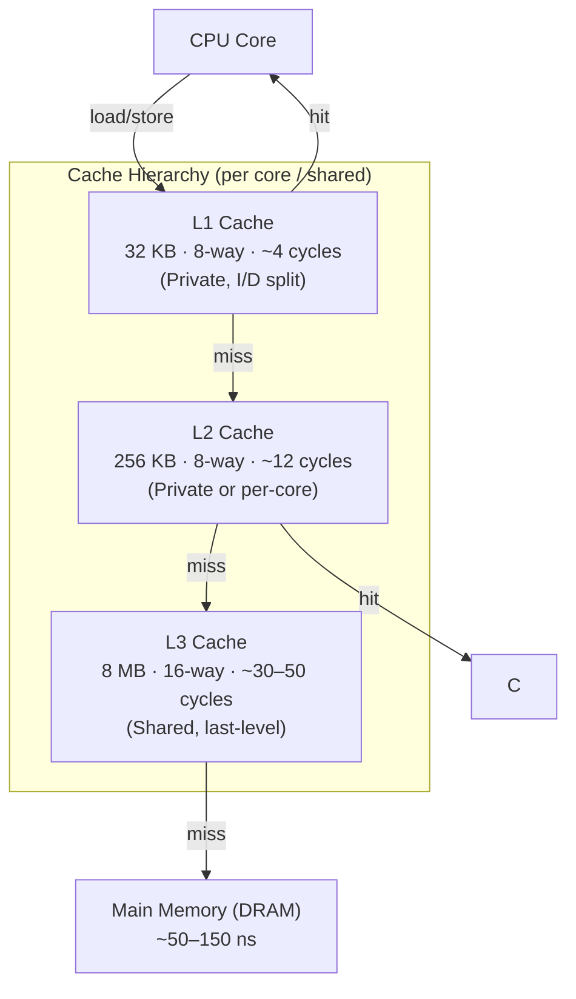

# What Every Programmer Should Know..

## CPU and Memory

Caching works on the princile of temporal and spatial locality of reference. Caches are typically organized as hierarchies. Lower levels are closer to the CPU. They are smaller - but much faster and more expensive. Typical caching model and sizes are shown below

## L1 Cache
- Separate Instruction and Data Cache
- Typical size of single line - 64 bytes
- Number of cache lines = 32 kB / 64 = 512
- 8 way means 512 / 8 = 64 sets.
- Lowest 8 bit of the address corerspond to offset within a cache line and next 8 bits *implicitly* correspond to the set. Upper 16 bits (in case of 32-bit addrss) correspond to Tag bits - which are stored for each cache entry.
- Multiple addresses *alias* to the same set within cache. with 8 way-associative caches when comparing Tag bits within an address, comparison with Tags for all 8 cache lines within a set are compared parallely for efficiency.
