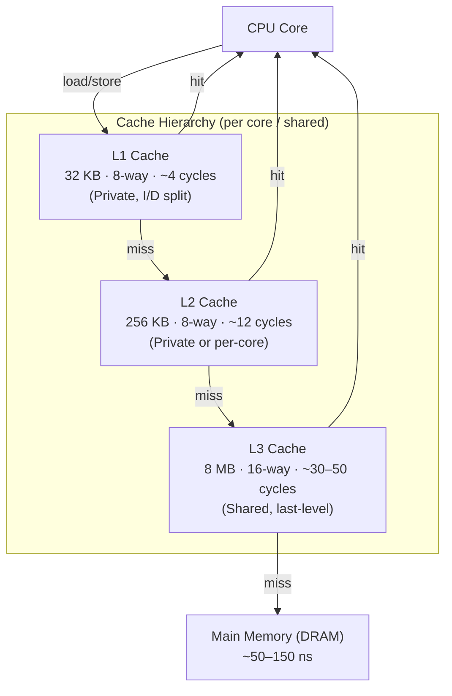
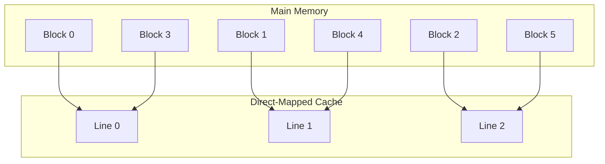
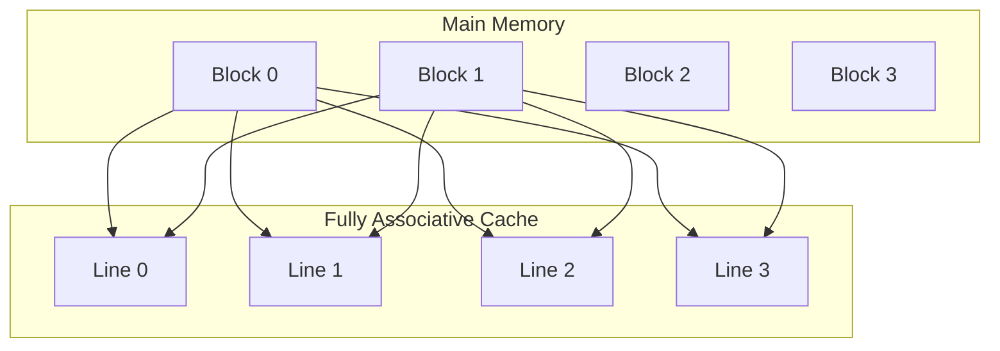
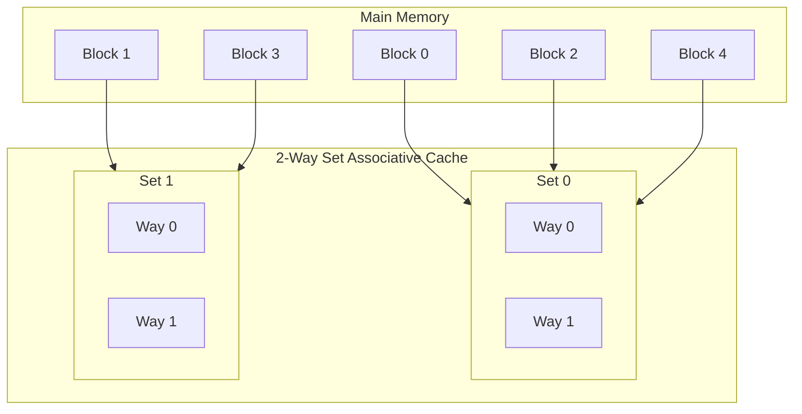

# What Every Programmer Should Know..
Most basic Operating System courses teach how Virtual Memory is used by modern operating systems. So we will skip that here. It suffices to know that the memory layout/map of a process is different on different operating systems and also depends on the type of CPU. For 64-bit linux, [x86_64](https://www.kernel.org/doc/Documentation/x86/x86_64/mm.txt) and [arm64](https://www.kernel.org/doc/Documentation/arm64/memory.txt) platforms, it can be quite different. Here we will focus primarily on how modern CPU work with caches and how that affects the system performance.

## CPU and Memory

Caching works on the principle of temporal and spatial locality of reference. Caches are typically organized as hierarchies. Lower levels are closer to the CPU. They are smaller - but much faster and more expensive. Typical caching model and sizes are shown below

## Type of Caches

### Direct Mapped

Any memory block can map onto one fixed cache line. These are easier to build but cache performance is not great due to high likelihood of collisons.

### Fully Associative

Any memory block can map onto any cache line. Flexible but expensive to build as we must compare the *tag* against all the entries in the cache.

### Set Associative

Cache is split into sets, each with multiple *ways* or lines. Balances flexibility and hardware cost. Typical in modern CPUs (8-way is common for L1).

## L1 Cache
- Separate Instruction and Data Cache
- Typical size of single line - 64 bytes
- Number of cache lines = 32 kB / 64 = 512
- 8 way means 512 / 8 = 64 sets.
- Lowest 8 bit of the address corerspond to offset within a cache line and next 8 bits *implicitly* correspond to the set. Upper 16 bits (in case of 32-bit addrss) correspond to Tag bits - which are stored for each cache entry.
- Multiple addresses *alias* to the same set within cache. with 8 way-associative caches when comparing Tag bits within an address, comparison with Tags for all 8 cache lines within a set are compared parallely for efficiency.

## Cost of Memory Access

| Memory Level       | Access Time (cycles) | Typical Size  | Notes                                                  |
| ------------------ | -------------------- | ------------- | ------------------------------------------------------ |
| L1 Cache           | 3 – 5                | 32–128 KB     | Fastest, private to core, VIPT (Virtually Indexed, Physically Tagged) indexing                |
| L2 Cache           | 10 – 20              | 256 KB – 1 MB | Private to core or cluster, slower than L1             |
| L3 Cache           | 30 – 50              | 2–64 MB       | Shared between cores, physically indexed               |
| Main Memory (DRAM) | 50 – 150             | GBs           | Orders of magnitude slower, physical address access    |
| SSD/NVMe Storage   | 100K – 1M            | TBs           | Persistent storage, accessed via OS/hardware interface |
| HDD                | 1M – 10M             | TBs           | Much slower, mechanical latency dominates              |

## References

- [What Every Programmer Should Know About Memory](https://people.freebsd.org/~lstewart/articles/cpumemory.pdf)
